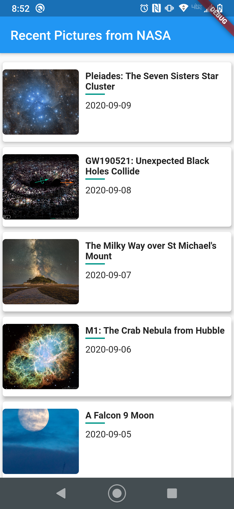
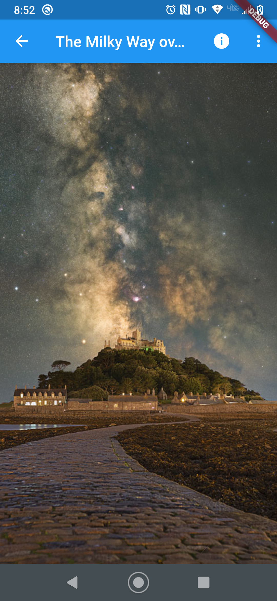
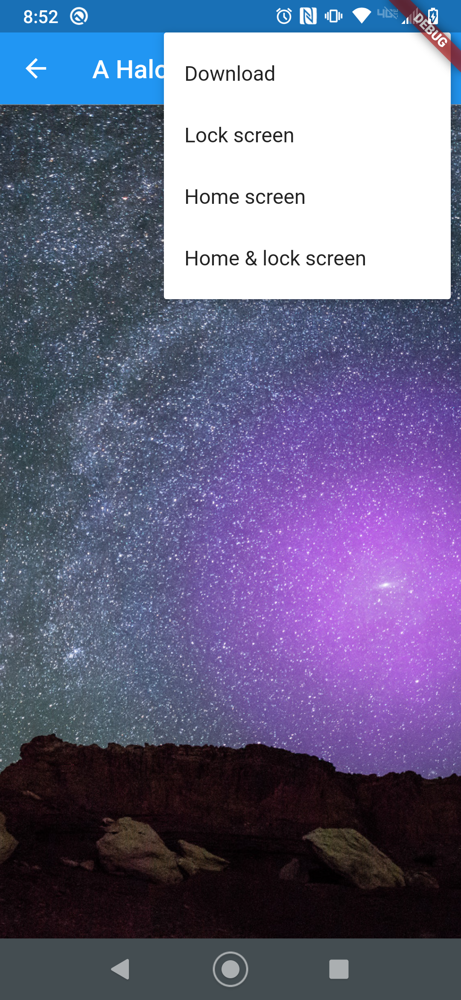

# astronomy-pic-of-the-day

  </a>
  
  

Flutter app for showing astronomy pic of the day using [NASA Open API](https://api.nasa.gov/). 
Includes option to download and set home and/or lock screen wallpaper of the image.

  Page Name | Image   
 :---: | :---: 
|
Main page | 
Image View | 
Image options | 
